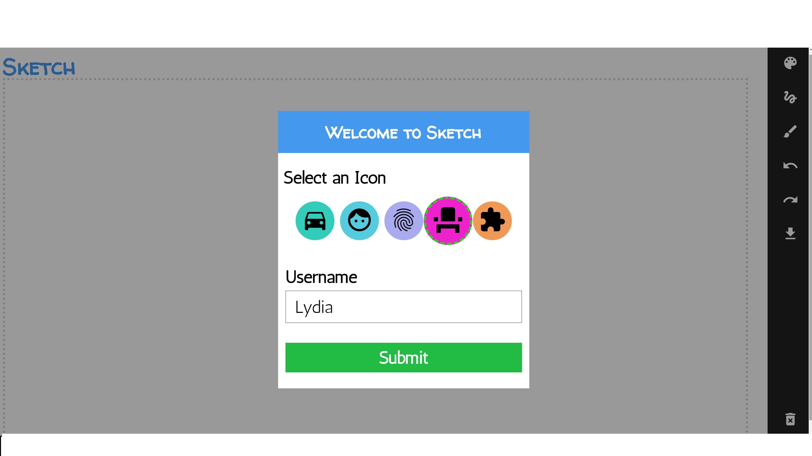
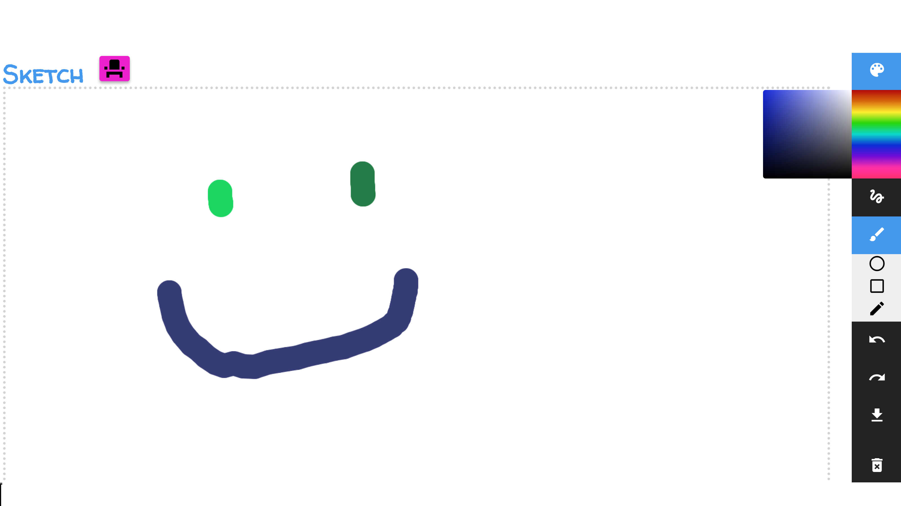

# Sketch
Unleash your creative prowess by using this online sketch pad. 

# <h2> Installation
Visit the link in the description to utilize this app. 
Be sure that your browser is capable of handling HTML canvas.

# <h2> Usage
Select an avatar icon and enter your name to begin (don't worry, none of your information will be stored!)

Hold the mouse down within the dotted broders to begin drawing. 
You can select the color, brush size, and brush type using the respective menu icons on the side bar.

Additionally, you can undo, redo, download, or clear your drawing through the side bar.

# <h2> Licensing 
This project is licensed under the GNU General Public License v3.0. 
For more information, please read the LICESNE.md document located in this repository.
